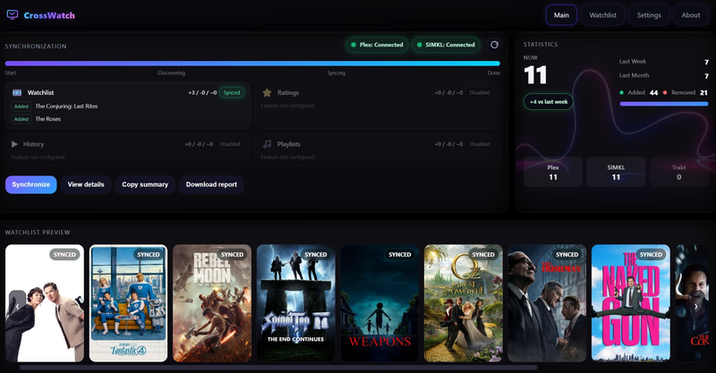

<p align="center">
  <br>
  
</p>

CrossWatch is a lightweight synchronization engine that keeps providers like Plex, SIMKL, and TRAKT libraries in harmony.
It offers a web-based control panel with a modular design for easily adding new providers in the feature.
Use its clean UI to link accounts, create sync pairs, run them manually or on a schedule, and monitor stats and history.

**Goal**
CrossWatch aims to become a one-for-all synchronization system for locally hosted environments. Its modular architecture allows new providers to be added easily. This approach keeps the system maintainable, testable, and easy to extend as new platforms emerge.

---
> :warning:  Before using this software ALWAYS make backups
---

## 🚀 Features
- Create sync pairs with advanced if/else scheduling support
- Sync watchlists (one-way or two-way)
- Live Scrobbling (Plex → Trakt)
- Sync Ratings (one-way or two-way — currently disabled)
- Sync Watch history (one-way or two-way — currently disabled)
- Sync Playlists (one-way or two-way — currently disable)
- Simple web UI — no external DB, just JSON state files
- Rich metadata & posters via TMDb
- Stats, history, and live logs built-in
- Headless scheduling of sync runs

---

## 🐳 Run as Container

```shell
docker run -d \
  --name crosswatch \
  -p 8787:8787 \
  -v /path/to/config:/config \
  -e TZ=Europe/Amsterdam \
  ghcr.io/cenodude/crosswatch:latest
```
> The container exposes the web UI at:  
> 👉 http://localhost:8787

By default `CONFIG_BASE` will be `/config` inside the container.  
Your `config.json`, `state.json`, `statistics.json`, etc. will all be stored there.

---

## ⚡ Local Development

```bash
git clone https://github.com/cenodude/CrossWatch.git
cd CrossWatch
pip install fastapi uvicorn requests plexapi packaging pydantic
python3 crosswatch.py
```

Then open:  
📍 http://localhost:8787

---

## 📋 Usage

1. Open the web UI
2. Connect at least two **Authentication providers** Plex, SIMKL and/or TRAKT [required]
3. Connect Metadata provier (TMDb) [optional]
3. Create one or more **Sync Pairs** [required]
4. Click **Synchronize** to start, or enable scheduling in **Settings**
5. Track stats, logs, and history from the UI

---
# 🎬 Live Scrobbling (Plex → Trakt)

CrossWatch can **scrobble your real-time Plex playback to Trakt** — so episodes and movies you watch are instantly marked as “Watching” or “Watched” on Trakt.

### How it works
- A background **watcher** connects to your Plex Media Server (via WebSocket).
- Every play/pause/stop is converted into a **ScrobbleEvent**.
- The event is enriched with TMDb/Tvdb/IMDb IDs and sent to **Trakt’s `/scrobble` API**.
- Built-in **deduplication, retries, and fallbacks** ensure stable reporting.

## 📎 API Reference

The backend exposes a REST API at `http://localhost:8787`.  
Main routes include:

- `/api/status`, `/api/version`, `/api/config`
- `/api/auth/providers`, `/api/plex/pin/new`, `/api/simkl/authorize`
- `/api/sync/providers`, `/api/pairs`, `/api/run`
- `/api/watchlist`, `/api/metadata/resolve`, `/api/scheduling`
- `/api/stats`, `/api/logs/stream`, `/api/troubleshoot/*`

---

## ⚖️ License

MIT © [cenodude](https://github.com/cenodude)
