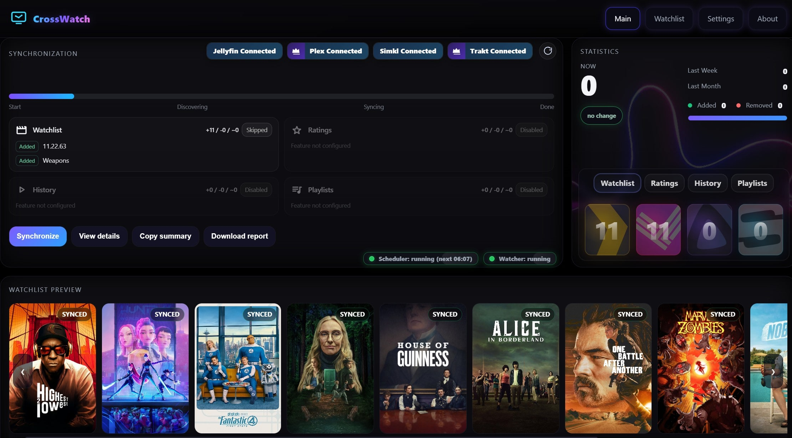
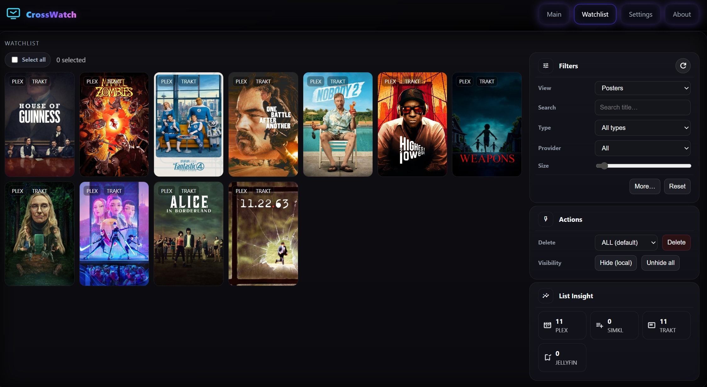

<div align="center"></div>

<!-- Screenshots row  -->
<p align="center">
  <a href="images/screenshot1.jpg">
    
  </a>
  <a href="images/screenshot2.jpg">
    
  </a>
  <a href="images/screenshot3.jpg">
    
  </a>
  <a href="images/screenshot4.jpg">
    
  </a>
</p>

<p align="center" style="font-size:14px;">
  <b>⭐ Star this repository to get updates</b>
</p>

<p align="center"><a href="https://github.com/cenodude/CrossWatch/releases/latest"> </a><a href="https://github.com/cenodude/CrossWatch/pkgs/container/crosswatch"> </a><a href="[https://github.com/cenodude/CrossWatch/wiki/Getting-Started](https://wiki.crosswatch.app/getting-started/first-time-setup)"></a><br><a href="https://hub.docker.com/r/cenodude/crosswatch"> </a><a href="https://hub.docker.com/r/cenodude/crosswatch"> </a><a href="https://hub.docker.com/r/cenodude/crosswatch/tags"></a></p>
<p align="center">
  <a href="https://www.crosswatch.app/" style="margin: 0 6px;">
    
  </a>
  <a href="https://wiki.crosswatch.app/" style="margin: 0 6px;">
    
  </a>
</p>


**CrossWatch/CW** is a synchronization engine that keeps your **Plex, Jellyfin, Emby, SIMKL, Trakt, AniList, TMDb, MDBList and Tautulli** in sync. It runs locally with a web UI where you link accounts, define sync pairs, run them manually or on a schedule, and review stats and history. CW also includes its own tracker to keep your data safe with snapshots.

Supported: **Movies** and **TV shows / episodes / Seasons**\
Supported: **Plex, Emby, Jellyfin, MDBList, Tautulli, AniList, Trakt, SIMKL, TMDb and CW internal tracker**\
NOT supported: **Multi-users/servers**


### CW in a nutshell:
* **One brain for all your media syncs** A single place to configure everything.
* **Multi media-server** and **multi tracker** support, in just one tool.
* **Mobile-friendly overview** that prioritizes only the essentials
* **Flexible sync directions** Between media server and trackers.
* **Simple and advanced scheduling** From standard to more detailed pair schedules
* **Internal CW Tracker** Keeps snapshots/backups from your media servers and trackers.
* **Unified Watchlist across providers** View all watchlist items in one place.
* **Fallback GUID** Revives old items from  your Plex library.
* **Watcher** (Plex/Emby/Jellyfin to Trakt/SIMKL/MDBList) subscription-free.
* **Watchlist Auto-Remove** Clears items from your Watchlist after a verified finish.
* **Analyzer** Finds items that are **stuck** or inconsistent between providers.
* **Editor** Inspect and adjust your items and add or block items.
* **Player card** Shows what you are currently watching in real time.
* **Snapshosts** Rollback tool for provider watchlist, ratings, and history

<!-- Features (no header row, titles visible, no "empty grid") -->
<table width="100%" border="0" cellspacing="0" cellpadding="0" style="border:0; border-collapse:collapse;">
  <tr>
    <td valign="top" width="50%" style="border:0; padding-right:18px;">
      <h4 style="margin:0 0 8px 0;">Core features</h4>
      <ul>
        <li>Sync watchlists (one-/two-way)</li>
        <li>Live scrobble (Plex/Jellyfin/Emby to Trakt/SIMKL/MDBList)</li>
        <li>Sync ratings (one-/two-way)</li>
        <li>Sync history (one-/two-way)</li>
        <li>Keep snapshots with CW tracker</li>
        <li>Auto-remove from watchlist after finish</li>
      </ul>
    </td>
    <td valign="top" width="50%" style="border:0; padding-left:18px;">
      <h4 style="margin:0 0 8px 0;">Tools &amp; modes</h4>
      <ul>
        <li>Analyzer: finds broken or missing matches/IDs</li>
        <li>Exporter: CSV files for popular services</li>
        <li>Editor: Edit and adjust your items</li>
        <li>Snapshots: Create and restore snapshots</li>
        <li>Now Playing card, Stats, history, live logs</li>
        <li>Headless scheduled runs</li>
      </ul>
      <p style="margin:10px 0 6px 0;"><b>Trackers</b><br>
        
        
        
        
        
        
      </p>
      <p style="margin:10px 0 6px 0;"><b>Media servers</b><br>
        
        
        
      </p>
      <p style="margin:10px 0 0 0;"><b>Others</b><br>
        
      </p>
    </td>
  </tr>
</table>


### Download

*   **Docker:**

    ```bash
    docker pull ghcr.io/cenodude/crosswatch:latest
    ```
* **Prebuilt releases:**\
  Get the latest builds and assets here: [**Releases ▸**](https://github.com/cenodude/CrossWatch/releases/latest)

<sub>Tip: use</sub> <sub></sub><sub>`:latest`</sub> <sub></sub><sub>for stable, or a specific tag like</sub> <sub></sub><sub>`:v0.2.x`</sub><sub>.</sub>

***

### Run as Container

```bash
docker run -d   --name crosswatch   -p 8787:8787   -v /path/to/config:/config   -e TZ=Europe/Amsterdam   ghcr.io/cenodude/crosswatch:latest
```

or

```bash
# docker-compose.yml
services:
  crosswatch:
    image: ghcr.io/cenodude/crosswatch:latest
    container_name: crosswatch
    ports:
      - "8787:8787"          # host:container
    environment:
      - TZ=Europe/Amsterdam
    volumes:
      - /path/to/config:/config
    restart: unless-stopped
```

> The container exposes the web UI at:\
> http://localhost:8787

### Usage

1. Open the web UI
2. Connect at least one authentication providers such as: Plex, Jellyfin, Emby, SIMKL, TRAKT etc.
3. Create one or more Sync Pairs (for example: Plex to SIMKL or two-way) AND/OR enable Scrobble
4. Click Synchronize to start, or enable scheduling in Settings
5. Track stats, logs, and history from the UI

## Sponsors

<div align="center">

<a href="https://www.buymeacoffee.com/cenodude">
  
</a><center><br>
Every cent goes to the <b>ALS Foundation</b> in the Netherlands</center>
<br/>
<br/>

<a href="https://www.gitbook.com/">
  
</a>

</div>

<p align="center">
  Huge thanks to our sponsors for keeping this project moving.
</p>


