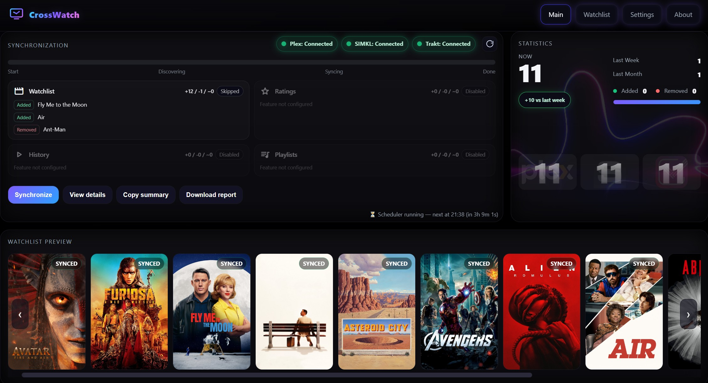
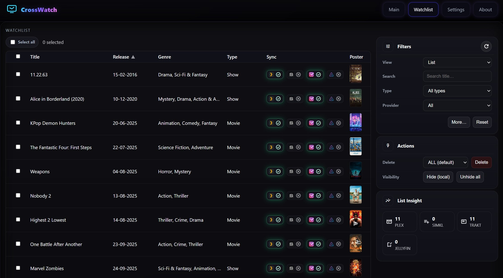
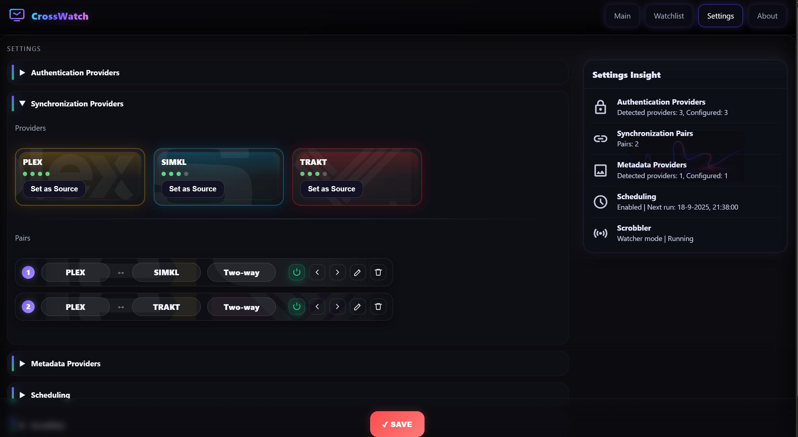
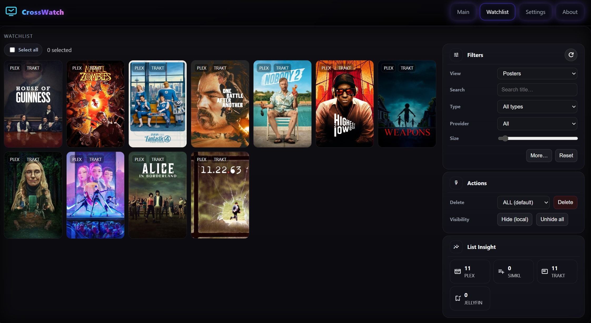

# CrossWatch

<!-- Download + Wiki buttons -->
<div align="center" style="margin: 6px 0 18px;">
  <a href="https://github.com/cenodude/CrossWatch/releases/latest"
     target="_blank" rel="noopener noreferrer"
     style="display:inline-block;margin:4px 6px;padding:8px 14px;border-radius:6px;background:#1f2328;color:#fff;text-decoration:none;font-weight:600;">
    ⬇️ Download (Latest)
  </a>
  <a href="https://github.com/cenodude/CrossWatch/wiki"
     target="_blank" rel="noopener noreferrer"
     style="display:inline-block;margin:4px 6px;padding:8px 14px;border-radius:6px;background:#1f2328;color:#fff;text-decoration:none;font-weight:600;">
    📘 Read the CrossWatch Wiki
  </a>
</div>

<!-- Logo centered -->
<p align="center">
  
</p>

<!-- Click-to-zoom screenshots (links to full size) -->
<p align="center">
  <a href="images/screenshot1.jpg">
    
  </a>
  <a href="images/screenshot2.jpg">
    
  </a>
  <a href="images/screenshot3.jpg">
    
  </a>
  <a href="images/screenshot4.jpg">
    
  </a>
</p>

<p align="center"><sub>Click any screenshot to view it full size.</sub></p>

<p align="center"><b>New version 0.2.x is released with huge improvements — <i>Multi-arch images (AMD64 + ARM64)</i></b></p>

**CrossWatch** is a lightweight synchronization engine that keeps your **Plex, Jellyfin, Emby**, Simkl, and Trakt in sync. It runs locally with a clean web UI to link accounts, configure sync pairs, run them manually or on schedule, and track stats/history. It also fully replaces my previous project Plex2SIMKL, with a more modular architecture and broader multi-provider support.

CrossWatch aims to become a one-for-all synchronization system for locally hosted environments. Its modular architecture allows new providers to be added easily. This approach keeps the system maintainable, testable, and easy to extend as new platforms emerge.

---

<h2 align="center">🚀 Features</h2>

<div align="center">
  <table style="display:inline-block;text-align:left;">
    <tr>
      <td valign="top">
        <ul style="margin:0;padding-left:1.1em">
          <li>Sync watchlists (one-/two-way)</li>
          <li>Live scrobbling (Plex/Jellyfin/Emby → Trakt)</li>
          <li>Sync ratings (one-/two-way)</li>
          <li>Sync watch history (one-/two-way)</li>
          <li>Sync playlists (one-/two-way — disabled)</li>
        </ul>
      </td>
      <td valign="top">
        <ul style="margin:0;padding-left:1.1em">
          <li>Simple web UI — JSON state</li>
          <li>TMDb metadata & posters</li>
          <li>Stats, history, live logs</li>
          <li>Headless scheduled runs</li>
          <li><strong>Trackers:</strong>
            
            &nbsp;
          </li>
          <li><strong>Media servers:</strong>
            
            &nbsp;
            &nbsp;
          </li>
        </ul>
      </td>
    </tr>
  </table>
</div>

---

## ⬇️ Download

- **Docker (recommended):**
  ```bash
  docker pull ghcr.io/cenodude/crosswatch:latest
  ```
- **Prebuilt releases:**  
  Get the latest builds and assets here → **[Releases ▸](https://github.com/cenodude/CrossWatch/releases/latest)**

<sub>Tip: use <code>:latest</code> for stable, or a specific tag like <code>:v0.2.x</code>.</sub>

---

## 🐳 Run as Container

```bash
docker run -d   --name crosswatch   -p 8787:8787   -v /path/to/config:/config   -e TZ=Europe/Amsterdam   ghcr.io/cenodude/crosswatch:latest
```

or

```bash
# docker-compose.yml
services:
  crosswatch:
    image: ghcr.io/cenodude/crosswatch:latest
    container_name: crosswatch
    ports:
      - "8787:8787"          # host:container
    environment:
      - TZ=Europe/Amsterdam
    volumes:
      - /path/to/config:/config
    restart: unless-stopped
```

> The container exposes the web UI at:  
> 👉 http://localhost:8787

By default <code>CONFIG_BASE</code> will be <code>/config</code> inside the container.  
Your <code>config.json</code>, <code>state.json</code>, <code>statistics.json</code>, etc. will all be stored there.

---

## 📋 Usage

1. Open the web UI  
2. Connect at least two authentication providers — Plex, Jellyfin, <b>Emby</b>, SIMKL and/or TRAKT  
3. Create one or more <b>Sync Pairs</b> (e.g. Plex → SIMKL or two-way) and/or enable Scrobble  
4. Click <b>Synchronize</b> to start, or enable scheduling in <b>Settings</b>  
5. Track stats, logs, and history from the UI

---

## 🎬 Live Scrobbling (Plex/Jellyfin/Emby → Trakt)

CrossWatch can <b>scrobble your real-time Plex, Jellyfin, and Emby playback to Trakt</b> — so episodes and movies you watch are instantly marked as “Watching” or “Watched” on Trakt.  
Have Plex Pass / Emby Premiere? Prefer <b>Webhook</b>. No Pass/Premiere? Use the <b>Watcher</b>. Jellyfin users: use <b>Webhook</b>.

---

## ⚖️ License

MIT © <a href="https://github.com/cenodude">cenodude</a>
