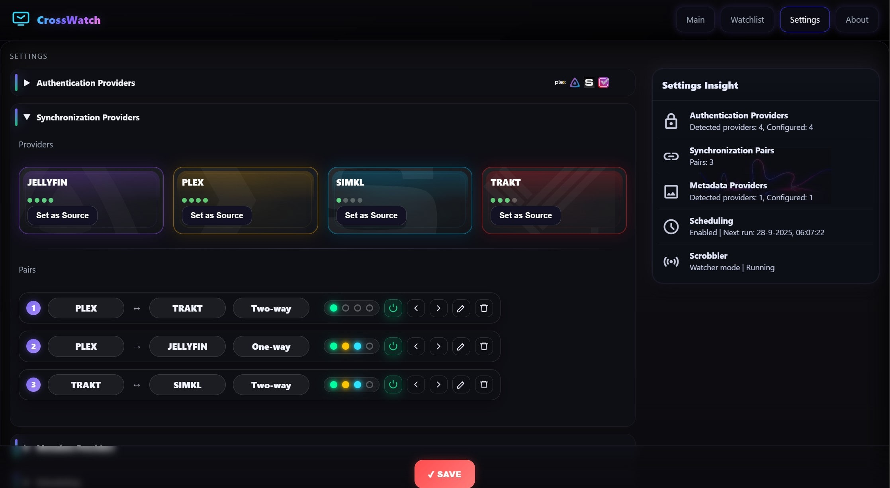

<!-- Logo centered -->
<p align="center">
  
</p>

<!-- Click-to-zoom screenshots (links to full size) -->
<p align="center">
  <a href="images/screenshot1.jpg">
    
  </a>
  <a href="images/screenshot2.jpg">
    
  </a>
  <a href="images/screenshot3.jpg">
    
  </a>
</p>

<p align="center"><sub>Click any screenshot to view it full size.</sub></p>


**CrossWatch** is a lightweight synchronization engine that keeps your Plex, Simkl, and Trakt libraries in sync.  It runs locally with a clean web UI to link accounts, configure sync pairs, run them manually or on schedule, and track stats/history.  It also fully replaces my previous project Plex2SIMKL, with a more modular architecture and broader multi-provider support.

CrossWatch aims to become a one-for-all synchronization system for locally hosted environments. Its modular architecture allows new providers to be added easily. This approach keeps the system maintainable, testable, and easy to extend as new platforms emerge.
<center>⚠️  Before using this software ALWAYS make backups</center>


---

## 🚀 Features

- Sync watchlists (one-way or two-way)
- Live Scrobbling (Plex → Trakt) doest require webhooks
- Sync Ratings (one-way or two-way - currently disabled in alpha version)
- Sync Watch history (one-way or two-way - currently disabled in alpha version)
- Sync Playlists (one-way or two-way - currently disabled in alpha version)

- Simple web UI — no external DB, just JSON state files
- Rich metadata & posters via TMDb
- Stats, history, and live logs built-in
- Headless scheduling of sync runs

---

## 🐳 Run as Container

```bash
docker run -d   --name crosswatch   -p 8787:8787   -v /path/to/config:/config   -e TZ=Europe/Amsterdam   ghcr.io/cenodude/crosswatch:latest
```

> The container exposes the web UI at:  
> 👉 http://localhost:8787

By default `CONFIG_BASE` will be `/config` inside the container.  
Your `config.json`, `state.json`, `statistics.json`, etc. will all be stored there.

---

## 🧩 Architecture

- **FastAPI** backend (`crosswatch.py`) at port `8787`
- **Vanilla JS/CSS** UI served from `/assets/`
- Pluggable **providers**:  
  - `auth` (Plex device PIN, SIMKL OAuth, TRAKT)
  - `sync` (PLEX ⇄ SIMKL ⇄ TRAKT)
  - `metadata` (TMDb enrichment)
- All state/config stored as JSON in `CONFIG_BASE`

---


## ⚡ Local Development

```bash
git clone https://github.com/cenodude/CrossWatch.git
cd CrossWatch
pip install fastapi uvicorn requests plexapi packaging pydantic
python3 crosswatch.py
```

Then open:  
📍 http://localhost:8787

---

## 📋 Usage

1. Open the web UI
2. Connect at least two Authentication providers, Plex, SIMKL and/or TRakt under
3. Create one or more **Sync Pairs** (e.g. Plex → SIMKL or two-way)
4. Click **Synchronize** to start, or enable scheduling in **Settings**
5. Track stats, logs, and history from the UI

---

## 🛠 Troubleshooting

Open **Settings → Troubleshoot** to access three quick-fix actions:

- **Clear cache** — Purges cached data so fresh metadata is fetched next time.  
  `POST /api/troubleshoot/clear-cache`
- **Reset stats** — Resets usage/summary counters used for insights.  
  `POST /api/troubleshoot/reset-stats`
- **Reset state** — Reinitializes app state (filters, view prefs, local UI). Linked accounts are not touched.  
  `POST /api/troubleshoot/reset-state`

---
# 🎬 Live Scrobbling (Plex → Trakt)

CrossWatch can **scrobble your real-time Plex playback to Trakt** — so episodes and movies you watch are instantly marked as “Watching” or “Watched” on Trakt.

### How it works
- A background **watcher** connects to your Plex Media Server (via WebSocket).
- Every play/pause/stop is converted into a **ScrobbleEvent**.
- The event is enriched with TMDb/Tvdb/IMDb IDs and sent to **Trakt’s `/scrobble` API**.
- Built-in **deduplication, retries, and fallbacks** ensure stable reporting.

---

## ⚖️ License

MIT © [cenodude](https://github.com/cenodude)
