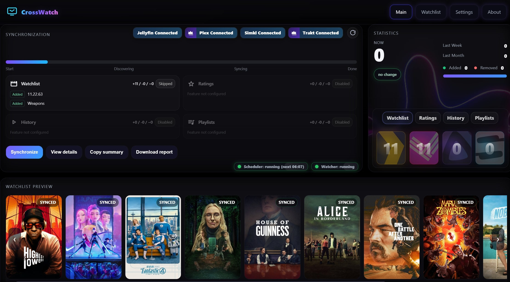
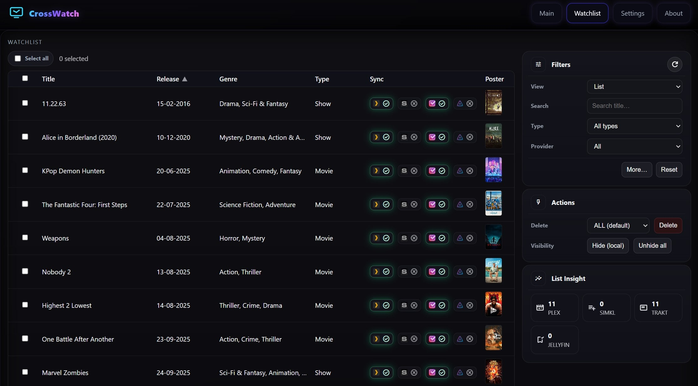
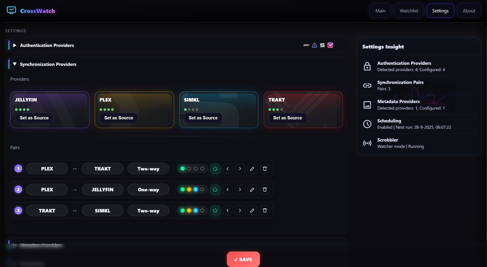

<p align="center">
  
</p>

<p align="center">
  <a href="images/screenshot1.jpg" data-cw-gallery="screenshots">
    
  </a>
  <a href="images/screenshot2.jpg" data-cw-gallery="screenshots">
    
  </a>
  <a href="images/screenshot3.jpg" data-cw-gallery="screenshots">
    
  </a>
  <a href="images/screenshot4.jpg" data-cw-gallery="screenshots">
    
  </a>
</p>

<p align="center"><sub>Click any screenshot to view it full size.</sub></p>

<script defer src="assets/js/cw-lightbox.js"></script>
<p align="center">
  
</p>
<p align="center">
  <a href="https://github.com/cenodude/CrossWatch/releases/latest">
    
  </a>
  <a href="https://github.com/cenodude/CrossWatch/wiki/Getting-Started">
    
  </a>

  <br/>

  <a href="https://hub.docker.com/r/cenodude/crosswatch">
    
  </a>
  <a href="https://hub.docker.com/r/cenodude/crosswatch">
    
  </a>
  <a href="https://hub.docker.com/r/cenodude/crosswatch/tags">
    
  </a>
</p>

**CrossWatch/CW** is a synchronization engine that keeps your **Plex, Jellyfin, Emby, SIMKL, Trakt, AniList, MDBList and Tautulli** in sync. It runs locally with a web UI where you link accounts, define sync pairs, run them manually or on a schedule, and review stats and history. CW also includes its own tracker to keep your data safe with snapshots.  

Supported: **Movies** and **TV shows / episodes / Seasons**  <br>
Supported: **Plex, Emby, Jellyfin, MDBList, Tautulli, AniList, Trakt, SIMKL and CW internal tracker** <br>
NOT supported: **Multi-users/servers**

## CW in a nutshell:
- **One brain for all your media syncs** A single place to configure and understand everything.
- **Multi-server** (Plex, Jellyfin, Emby) and multi-tracker (Trakt, SIMKL, MDBList, AniList) in one tool.  
- **Flexible sync directions** Between media server. Between trackers. Or from/to media servers and trackers.  
- **Simple and advanced scheduling** From “run once a day” to more detailed, time-based pair schedules
- **Internal CW Tracker** Keeps snapshots/backups from your media servers and trackers.
- **Unified Watchlist across providers** View all watchlist items in one place.
- **Back-to-the-Future (Fallback GUID)** Revives items that left your Plex library but still exist in your server database.
- **Watcher** (Plex / Emby / Jellyfin to Trakt/SIMKL/MDBList. Realtime, Plugin-free and subscription-free.
- **Watchlist Auto-Remove** Clears items from your Watchlist after a verified finish. 
- **Analyzer** Finds items that are **stuck** or inconsistent between providers.
- **Editor** Inspect and adjust your items and Add or block items. Example: tell Plex to stop sending movie X.
- **Player card** (Webhooks and Watcher) Shows what you are currently watching in real time while Webhooks or Watcher are active.
<p align="center">
  
</p>

<h2>Features</h2>

<div align="center">

<table border="0" cellspacing="0" cellpadding="10">
  <tr>
    <td valign="top" align="left" width="520">

<b>Core features</b>

<ul>
  <li>Sync watchlists (one-/two-way)</li>
  <li>Live scrobble (Plex/Jellyfin/Emby to Trakt/SIMKL/MDBList)</li>
  <li>Sync ratings (one-/two-way)</li>
  <li>Sync history (one-/two-way)</li>
  <li>Keep snapshots with CW tracker</li>
  <li>Auto-remove from watchlist after finish</li>
</ul>
    </td>
    <td valign="top" align="left" width="520">

<b>Tools & modes</b>

<ul>
  <li>Analyzer: finds broken or missing matches/IDs</li>
  <li>Exporter: CSV files for popular services</li>
  <li>Editor: Edit and adjust your items</li>
  <li>Now Playing card, Stats, history, live logs</li>
  <li>Headless scheduled runs</li>
</ul>

<b>Trackers</b><br/>

&nbsp;
&nbsp;
&nbsp;
&nbsp;

<b>Media servers</b><br/>

&nbsp;
&nbsp;

<b>Others</b><br/>

    </td>
  </tr>
</table>

</div>

## Download

- **Docker:**
  ```bash
  docker pull ghcr.io/cenodude/crosswatch:latest
  ```
- **Prebuilt releases:**  
  Get the latest builds and assets here: **[Releases ▸](https://github.com/cenodude/CrossWatch/releases/latest)**

<sub>Tip: use <code>:latest</code> for stable, or a specific tag like <code>:v0.2.x</code>.</sub>

---

## Run as Container

```bash
docker run -d   --name crosswatch   -p 8787:8787   -v /path/to/config:/config   -e TZ=Europe/Amsterdam   ghcr.io/cenodude/crosswatch:latest
```

or

```bash
# docker-compose.yml
services:
  crosswatch:
    image: ghcr.io/cenodude/crosswatch:latest
    container_name: crosswatch
    ports:
      - "8787:8787"          # host:container
    environment:
      - TZ=Europe/Amsterdam
    volumes:
      - /path/to/config:/config
    restart: unless-stopped
```

> The container exposes the web UI at:  
> http://localhost:8787

By default <code>CONFIG_BASE</code> will be <code>/config</code> inside the container.  
Your <code>config.json</code>, <code>state.json</code>, <code>statistics.json</code>, etc. will all be stored there.

## Usage
1. Open the web UI  
2. Connect at least one authentication providers such as: Plex, Jellyfin, Emby, SIMKL, TRAKT etc.
3. Create one or more <b>Sync Pairs</b> (for example: Plex to SIMKL or two-way) AND/OR enable Scrobble  
4. Click <b>Synchronize</b> to start, or enable scheduling in <b>Settings</b>  
5. Track stats, logs, and history from the UI
