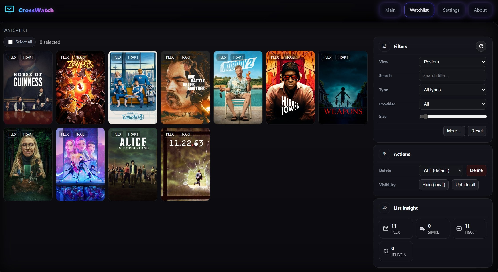

  <a class="cw-cta" href="https://github.com/cenodude/CrossWatch">
    
    Join us on GitHub
  </a>

<!-- Screenshots (small thumbs, click to zoom) -->

  
  
  
  

Click any screenshot to view it full size.

 

  
  

**CrossWatch/CW** is a synchronization engine that keeps your **Plex, Jellyfin, Emby, SIMKL, Trakt, AniList, TMDb, MDBList and Tautulli** in sync. It runs locally with a web UI where you link accounts, define sync pairs, run them manually or on a schedule, and review stats and history. CW also includes its own tracker to keep your data safe with snapshots.

Supported: **Movies** and **TV shows / episodes / Seasons**\
Supported: **Plex, Emby, Jellyfin, MDBList, Tautulli, AniList, Trakt, SIMKL, TMDb and CW internal tracker**\
NOT supported: **Multi-users/servers**

### CW in a nutshell:
* **One brain for all your media syncs** A single place to configure everything.
* **Multi media-server** and **multi tracker** support, in just one tool.
* **Mobile-friendly overview** that prioritizes only the essentials
* **Flexible sync directions** Between media server and trackers.
* **Simple and advanced scheduling** From standard to more detailed pair schedules
* **Internal CW Tracker** Keeps snapshots/backups from your media servers and trackers.
* **Unified Watchlist across providers** View all watchlist items in one place.
* **Fallback GUID** Revives old items from  your Plex library.
* **Watcher** (Plex/Emby/Jellyfin to Trakt/SIMKL/MDBList) subscription-free.
* **Watchlist Auto-Remove** Clears items from your Watchlist after a verified finish.
* **Analyzer** Finds items that are **stuck** or inconsistent between providers.
* **Editor** Inspect and adjust your items and add or block items.
* **Player card** Shows what you are currently watching in real time.
* **Snapshosts** Rollback tool for provider watchlist, ratings, and history

### Features

<table data-header-hidden>
  <thead>
    <tr>
      <th valign="top"></th>
      <th valign="top"></th>
    </tr>
  </thead>
  <tbody>
    <tr>
      <td valign="top">
        
Core features

        <ul>
          <li>Sync watchlists (one-/two-way)</li>
          <li>Live scrobble (Plex/Jellyfin/Emby to Trakt/SIMKL/MDBList)</li>
          <li>Sync ratings (one-/two-way)</li>
          <li>Sync history (one-/two-way)</li>
          <li>Keep snapshots with CW tracker</li>
          <li>Auto-remove from watchlist after finish</li>
        </ul>
      </td>
      <td valign="top">
        
Tools &#x26; modes

        <ul>
          <li>Analyzer: finds broken or missing matches/IDs</li>
          <li>Exporter: CSV files for popular services</li>
          <li>Editor: Edit and adjust your items</li>
          <li>Now Playing card, Stats, history, live logs</li>
          <li>Headless scheduled runs</li>
        </ul>

        
Trackers 
          
          
          
          
          
          
        

        
Media servers 
          
          
          
        

        
Others 
          
        

      </td>
    </tr>
  </tbody>
</table>
